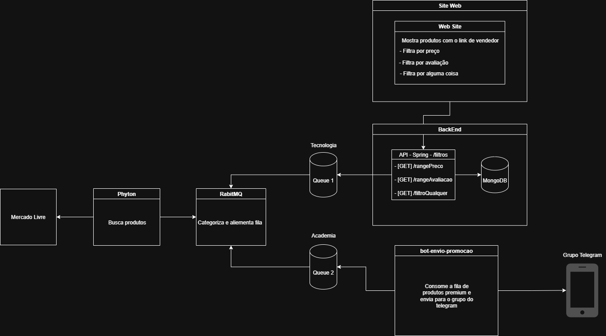

# 🐇 RabbitDeals — Pipeline E2E  

  
  
  
  
  
  
  

---

## ✨ Visão Geral

Este projeto coleta anúncios do **Mercado Livre** via um **scraper em Python**, publica os melhores no **RabbitMQ** e encaminha, via roteamento por *exchange*, para o segmento correto:

- 🔌 **Tecnologia** → permanece na fila de tecnologia  
- 🏋️ **Academia** → é entregue para a **API Java (Spring Boot)**, que persiste em **MongoDB** e disponibiliza os dados para o **front-end React**.

> ✅ **Professor autorizou** que o **Python** fosse o **produtor** no lugar do Java, **desde que** o Java atuasse como **consumidor via API**.  
> Esta arquitetura segue exatamente esse requisito.

---

## 🧩 Arquitetura


---

## 🗂️ Tecnologias

- **Python 3.11+** → Scraper + Worker/Producer  
- **RabbitMQ 3-management** → Mensageria + Painel Web  
- **Java 21 / Spring Boot 3** → API REST (consumidor)  
- **MongoDB 6** + **Mongo Express** → Banco + Admin Web  
- **React + Vite + Nginx** → Front-end em produção  
- **Docker & Docker Compose** → Orquestração  

---

## 📦 Estrutura

.
├─ docker-compose.yml
├─ .env
├─ java-api/ # API Java (Dockerfile multi-stage clona GitHub)
│ └─ Dockerfile
├─ python-app/ # Scraper + Producer Python
│ ├─ Dockerfile
│ ├─ requirements.txt
│ ├─ categorias.py
│ └─ app.py
└─ frontend/ # Front-end React+Vite com Nginx
├─ Dockerfile
└─ nginx.conf

makefile
Copy code

---


<div align="center">
  <h1>🐇 <span style="color:#6c63ff">RabbitDeals</span> — Pipeline E2E</h1>
  
  
  
  
  
  
  
</div>


<div align="center">
  <h2>🚨 <span style="color:#ff9800">ATENÇÃO: ARQUITETURA AUTORIZADA PELO PROFESSOR</span> 🚨</h2>
  <strong style="font-size:1.2em; color:#43a047;">O <span style="color:#fbc02d">Python</span> foi autorizado como <u>PRODUTOR</u> pelo professor!</strong><br>
  <em>O Java atua como consumidor via API, conforme exigência expressa.</em>
</div>


## ✨ Visão Geral

Este projeto coleta anúncios do <strong>Mercado Livre</strong> via um <strong>scraper em Python</strong>, publica os melhores no <strong>RabbitMQ</strong> e encaminha, via roteamento por <em>exchange</em>, para o segmento correto:

- 🔌 <strong>Tecnologia</strong> → permanece na fila de tecnologia
- 🏋️ <strong>Academia</strong> → é entregue para a <strong>API Java (Spring Boot)</strong>, que persiste em <strong>MongoDB</strong> e disponibiliza os dados para o <strong>front-end React</strong>.

<div align="center">
  
</div>


## 🧩 Arquitetura

<div align="center">
  
</div>


## �️ Tecnologias

- <strong>Python 3.11+</strong> → Scraper + Worker/Producer
- <strong>RabbitMQ 3-management</strong> → Mensageria + Painel Web
- <strong>Java 21 / Spring Boot 3</strong> → API REST (consumidor)
- <strong>MongoDB 6</strong> + <strong>Mongo Express</strong> → Banco + Admin Web
- <strong>React + Vite + Nginx</strong> → Front-end em produção
- <strong>Docker & Docker Compose</strong> → Orquestração


## 📦 Estrutura

```text
.
├─ docker-compose.yml
├─ .env
├─ java-api/         # API Java (Dockerfile multi-stage clona GitHub)
│   └─ Dockerfile
├─ python-app/       # Scraper + Producer Python
│   ├─ Dockerfile
│   ├─ requirements.txt
│   ├─ categorias.py
│   └─ app.py
└─ frontend/         # Front-end React+Vite com Nginx
```

Buildado com Vite → servido pelo Nginx na porta 80


## 🔧 Variáveis de Ambiente (.env)

Crie um arquivo <code>.env</code> na raiz do projeto com o seguinte conteúdo:

```env
RABBITMQ_USER=admin
RABBITMQ_PASS=admin
RABBITMQ_EXCHANGE=categoria_exchange
RABBITMQ_QUEUE_ACADEMIA=academia_queue
RABBITMQ_QUEUE_TECNOLOGIA=tecnologia_queue

API_PORT=8080
MONGODB_URI=mongodb://mongodb:27017/produtosdb

SCRAPER_SLEEP_SECS=120
MAX_PAGINAS=1

ME_USER=admin
ME_PASS=admin
```

---

## ▶️ Rodando o Projeto

```bash
# Subir todos os serviços
docker compose up --build
```

### Acesse os serviços:

- 🐇 <strong>RabbitMQ Management</strong> → [http://localhost:15672](http://localhost:15672) <code>(admin/admin)</code>
- 🍃 <strong>Mongo Express</strong> → [http://localhost:8081](http://localhost:8081) <code>(admin/admin)</code>
- ☕ <strong>API Java (Swagger)</strong> → [http://localhost:8080/swagger-ui.html](http://localhost:8080/swagger-ui.html)
- 💻 <strong>Front-end</strong> → [http://localhost](http://localhost)

---

## 🧪 Endpoints Principais (API)

- <code>POST /anuncios</code> → Recebe JSON de anúncio (Academia)
- <code>GET /anuncios</code> → Lista anúncios paginados (para o front-end)
- <code>GET /actuator/health</code> → Health check

<details>
<summary>Exemplo de requisição</summary>

```http
POST http://localhost:8080/anuncios
Content-Type: application/json

{
  "id": 123,
  "titulo": "Kit Halteres Ajustáveis 20kg",
  "preco": 399.90,
  "imagemUrl": "https://ml.com/p/halteres-20kg",
  "categoria": "Academia",
  "descricaoCurta": "Item simulado para testes"
}
```
</details>

---

## 🐍 Worker Python

- Produz mensagens com anúncios scrapeados (publica no <code>categoria_exchange</code>)
- Classifica: "Academia" ou "Tecnologia"
- Consome a fila <code>academia_queue</code> e faz <code>POST /anuncios</code> na API Java

<div align="center">
  
</div>

---

## 💻 Front-end

- Buildado com Vite → servido pelo Nginx na porta 80
- Proxy configurado (<code>/api</code>) → redireciona automaticamente para a API Java (<code>http://api:8080</code>)
- Acesse em [http://localhost](http://localhost)

---

## 🧰 Comandos Úteis

```bash
# Logs em tempo real
docker compose logs -f python-app
docker compose logs -f api
docker compose logs -f rabbitmq
docker compose logs -f mongodb
docker compose logs -f frontend

# Rebuild de um serviço específico
docker compose build api
docker compose up -d api

# Reset geral
docker compose down -v
docker compose up --build
```

---

## ✅ Critérios Atendidos

<ul>
  <li><strong>Python</strong> atua como <span style="color:#fbc02d"><u>Produtor</u></span> <span style="font-size:1.2em">✔️</span></li>
  <li><strong>Java</strong> atua como <u>Consumidor via API</u> <span style="font-size:1.2em">✔️</span></li>
  <li>Dados persistem em <strong>MongoDB</strong></li>
  <li>Front consome a API sem CORS <span style="font-size:1.2em">✔️</span></li>
</ul>

---

## 📸 Screenshots (adicione em /docs)

- Painel RabbitMQ
- Mongo Express
- Swagger API
- Front-end em execução

---

## 👨‍🏫 Observação Final

<div align="center">
  <strong>Este repositório foi estruturado para facilitar a avaliação pelo professor, com tudo containerizado via Docker Compose.<br>
  Basta rodar <code>docker compose up --build</code> e testar ponta a ponta.</strong>
</div>